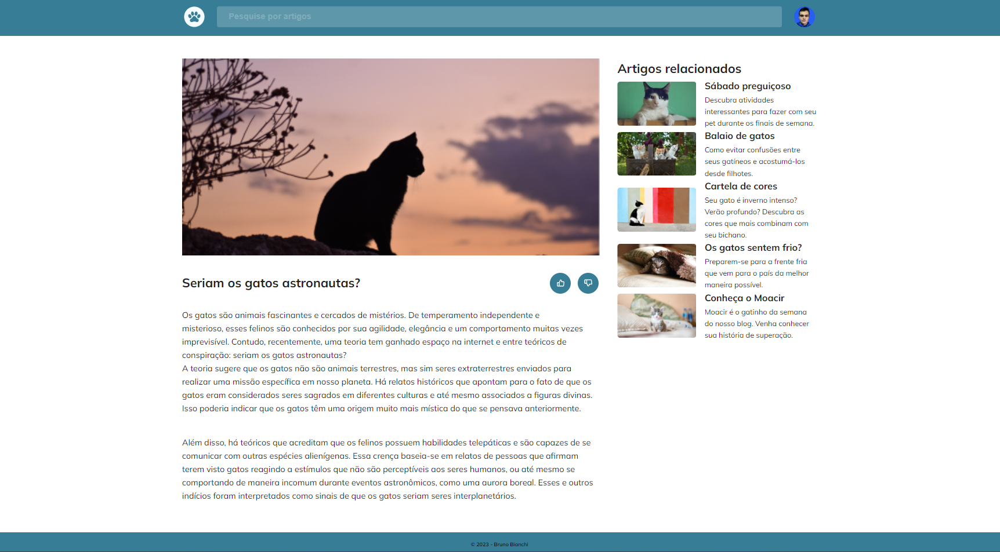
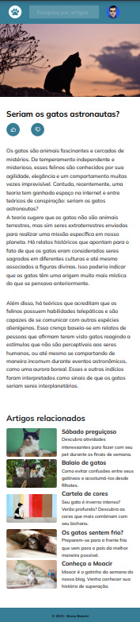

<h1 align="center"> Desafio Blog de Gato </h1>

Programa exclusivo do Bruno Bianchi, para ensino de tecnologias WEB.  
Desafio proposto pela Rocketseat, com objetivo de criar uma Blog de Gatos utilizando os seguintes recursos:

- Mobile First: inicie o projeto deixando-o responsivo em telas menores para depois ajustar para uma versão desktop;
- Unidade de medida flexível;
- Grid;
- Variáveis no CSS;
- Cores HSL;
- Animações e transições simples.

  <a href="#-tecnologias">Tecnologias</a>&nbsp;&nbsp;&nbsp;|&nbsp;&nbsp;&nbsp;
  <a href="#-projeto">Projeto</a>

  

  
  

 

## 🚀 Tecnologias

Esse projeto foi desenvolvido com as seguintes tecnologias:

- HTML e CSS
- Git e Github

## 💻 Projeto

O Desafio é criar um Blog de Gatos utilizando alguns recursos específicos.

- [Acesse o projeto finalizado, online](https://brunobianchi13.github.io/Desafio-Blog-de-Gato/)
- [Acesse o Layout no Figma](https://www.figma.com/file/Z9Bc7ANUUkwPsGiMPi4R8a/Blog-de-Gatos-%E2%80%A2-Desafio-Explorer-(Community)?node-id=0%3A1&mode=dev)

---

Feito by Bruno Bianchi

